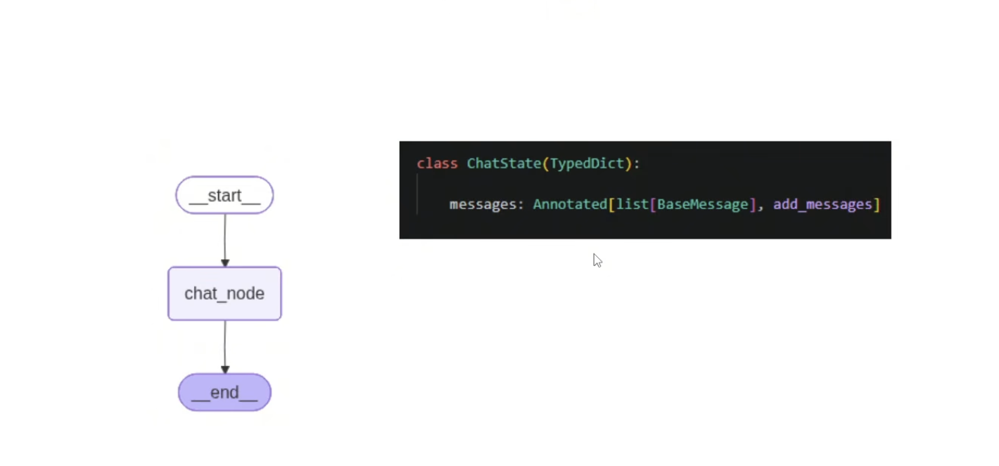

<iframe
  width="500" 
  height="500" 
  src="https://www.youtube.com/embed/l3cMKkLxSAU"
  frameborder="0"
  allowfullscreen>
</iframe>

#### Project Implementation

- Simple chatbot workflow
- Persistance in langgraph
- How to add streaming
- Resume chat
- Database inegration
- Chatbot UI
- Tools in langgraph
- Observability(Integration with lang smith)
- RAG
- HITL
- Short Term and Long Term Memory



Store the values in persistance
```python
 from langgraph.checkpoint.memory import MemorySaver

chatbot.get_state(config=config) //returs the history of chat
```
<iframe 
  src="/agentic_ai/playlist-notes/dswithbappy/13_Build_Your_First_Agentic_Chatbot_with_LangGraph/files/13_1_ChatbotFlow.html"
  width="100%" 
  height="800px">
</iframe>
